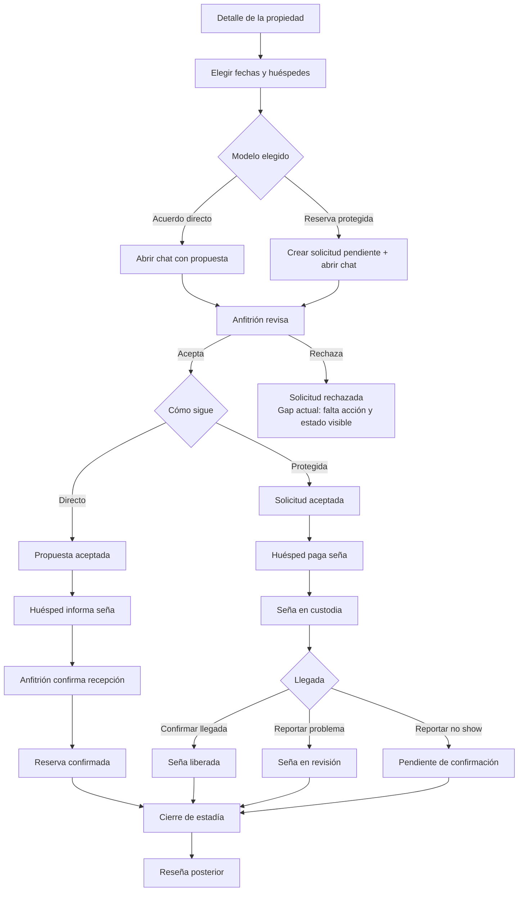

# Mapa UX del flujo de reserva

Este documento deja representado el flujo real de reserva tal como hoy se implementa en la plataforma. Sirve como referencia de producto para revisar estados, decisiones, mensajes visibles y puntos de fricción antes de seguir iterando.

## Qué diferencia a cada modelo

- Acuerdo directo: abre un chat con una propuesta concreta. La plataforma no interviene en la seña y las fechas no quedan bloqueadas en ese primer paso.
- Reserva protegida: crea una solicitud pendiente en la app, deja fechas, huéspedes y total asentados desde el inicio, y después resguarda la seña en custodia hasta la llegada.

## Superficies que hoy sostienen el flujo

- Detalle de propiedad: arma fechas, huéspedes y elección entre acuerdo directo o reserva protegida.
- Chat seguro: concentra aceptación, seguimiento de seña, mensajes automáticos y próximos pasos.
- Mis reservas: muestra estados, acciones del huésped y continuidad de la reserva.
- Panel de anfitrión: muestra estados, perfil del huésped y acciones del anfitrión.
- Lógica compartida: `src/lib/reservationFlow.ts` unifica etiquetas, descripciones y próximos pasos.

## Mapa end to end

## Flujo detallado por tramo

### 1. Entrada desde la propiedad

1. La persona entra al detalle de la propiedad.
2. Define fechas y huéspedes.
3. Elige uno de los dos modelos.
4. El CTA cambia según esa elección.

Resultado esperado:

- Si elige acuerdo directo, el siguiente paso real es abrir un chat para acordar.
- Si elige reserva protegida, el siguiente paso real es dejar una solicitud pendiente registrada en la app.

### 2. Rama de acuerdo directo

1. Se abre una conversación con la propuesta inicial.
2. El anfitrión revisa la propuesta en el chat.
3. Si acepta, el estado pasa a propuesta aceptada.
4. El huésped informa que envió la seña por fuera de la app.
5. El anfitrión confirma la recepción.
6. Recién ahí la reserva queda confirmada.
7. La llegada y el cierre se siguen coordinando por chat.
8. Cuando la estadía pasa a completada, se habilita la reseña.

Puntos clave de modelo:

- No hay custodia de seña.
- No hay intervención de pago por parte de la plataforma.
- La aceptación ordena el acuerdo, pero no equivale todavía a reserva confirmada.

### 3. Rama de reserva protegida

1. Se crea una solicitud pendiente con fechas, huéspedes y total.
2. Se abre el chat vinculado a esa solicitud.
3. El anfitrión revisa y acepta o rechaza.
4. Si acepta, el huésped paga la seña dentro del flujo protegido.
5. La seña queda en custodia.
6. Al llegar, el huésped puede confirmar llegada y liberar la seña.
7. Si algo no coincide, puede reportar un problema y la seña pasa a revisión.
8. Si se reporta no show, la seña queda pendiente de confirmación.
9. Cuando la estadía pasa a completada, se habilita la reseña.

Puntos clave de modelo:

- La solicitud queda registrada desde el inicio.
- La plataforma sí participa en el manejo de la seña.
- El momento de mayor confianza visible es seña en custodia.

## Estados que el flujo necesita mostrar

| Estado UX | Dónde aplica | Qué lo dispara | Estado actual |
| --- | --- | --- | --- |
| Solicitud enviada | Reserva protegida | Se crea la reserva pendiente | Implementado |
| Propuesta enviada | Acuerdo directo | Se abre el chat con la propuesta | Implementado como mejora de naming |
| Solicitud aceptada | Reserva protegida | El anfitrión acepta | Implementado |
| Propuesta aceptada | Acuerdo directo | El anfitrión acepta | Implementado como mejora de naming |
| Solicitud rechazada | Ambos modelos | El anfitrión rechaza | Gap actual |
| Seña informada | Acuerdo directo | El huésped informa pago | Implementado |
| Seña en custodia | Reserva protegida | El huésped paga la seña protegida | Implementado |
| Reserva confirmada | Ambos modelos | Confirmación final de la reserva | Implementado |
| Seña liberada | Reserva protegida | El huésped confirma llegada | Implementado |
| Seña en revisión | Reserva protegida | Se reporta problema de llegada | Implementado |
| Pendiente de confirmación | Reserva protegida | Se reporta no show | Implementado |

## Decisiones críticas del recorrido

| Decisión | Quién decide | Opciones visibles | Cobertura actual |
| --- | --- | --- | --- |
| Cómo avanzar | Huésped | Acuerdo directo o reserva protegida | Implementado |
| Aceptar o rechazar | Anfitrión | Aceptar o rechazar la propuesta/solicitud | Aceptar implementado, rechazar pendiente |
| Confirmar recepción | Anfitrión | Confirmar seña informada | Implementado en directo |
| Confirmar llegada | Huésped | Liberar seña | Implementado en protegida |
| Reportar problema | Huésped | Pasar a revisión | Implementado en protegida |
| Reportar no show | Anfitrión/plataforma | Pausar liberación | Implementado en protegida |

## Fricciones detectadas

1. El recorrido directo seguía usando la palabra solicitud en puntos donde en realidad todavía no existía una reserva protegida.
2. El CTA principal del detalle de propiedad no distinguía bien entre abrir chat y registrar una solicitud.
3. Los mensajes automáticos iniciales del chat usaban la misma terminología para ambos modelos.
4. La aceptación del anfitrión estaba clara como acción, pero no siempre como cambio de etapa visible según el modelo.
5. No existe hoy un rechazo explícito con estado persistido, CTA propio y explicación de qué hacer después.
6. Existe una duplicación potencial entre el flujo real inline de `PropertyDetail` y el componente `BookingConfirmationModal`, que necesita mantenerse alineado aunque hoy no sea la entrada principal montada.
7. El cierre de estadía y la reseña existen, pero el pasaje desde reserva activa a estadía completada no forma parte del relato principal del flujo de reserva.

## Cambios aplicados en este bloque

1. Se volvió explícito que el acuerdo directo abre chat y no registra una reserva protegida en ese paso.
2. El CTA principal del detalle de propiedad ahora cambia según modelo: acuerdo directo o solicitud protegida.
3. Las etiquetas compartidas de estado diferencian propuesta enviada/aceptada para directo y solicitud enviada/aceptada para protegida.
4. Los mensajes automáticos y toasts del chat se alinearon con esa diferencia.
5. Se dejó este documento como referencia canónica para revisar el flujo antes de tocar copy, UI o backend.

## Gaps abiertos

1. Falta implementar el rechazo explícito de solicitud/propuesta con persistencia, mensaje automático, estado visible y próximo paso claro para ambas partes.
2. Falta decidir si el cierre de estadía debe tener una transición visible dentro del flujo conversacional o mantenerse solo como estado derivado de la reserva.
3. Si `BookingConfirmationModal` vuelve a montarse en producción, debe seguir exactamente la misma terminología que el flujo inline.